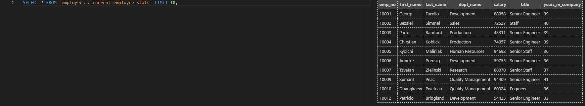
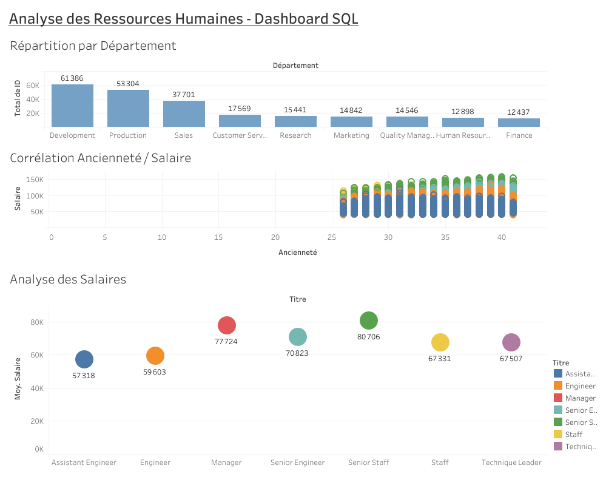

# 📊 ANALYSE RH & BIG DATA SQL (300k+ LIGNES)

---

## 📝 PRÉSENTATION DU PROJET
Ce projet simule une analyse de données réelle au sein d'un département RH en utilisant la base de données **"Employees"**. L'objectif est de transformer des millions de points de données brutes en **décisions stratégiques**.

> **Impact Business :** Identifier les écarts salariaux, analyser la rétention des talents et optimiser la performance des requêtes sur de gros volumes.

---

## 🛠️ COMPÉTENCES TECHNIQUES DÉMONTRÉES
* **Analyse Avancée :** Window Functions (`RANK`, `LEAD/LAG`, `AVG OVER`).
* **Data Engineering :** Nettoyage de données, gestion des dates fictives et création de tables de travail.
* **Performance :** Audit via `EXPLAIN` et optimisation par **Indexation B-Tree**.
* **Calculs RH :** Turnover, masse salariale, Gender Pay Gap.

---

## 🚀 ARCHITECTURE DES SCRIPTS
*Chaque étape est documentée et accessible via les liens ci-dessous :*

### 1️⃣ [NETTOYAGE & PRÉPARATION](./scripts/01_data_cleaning.sql)

* Standardisation des dates (gestion du `9999-01-01`).
* Création d'une table consolidée pour des jointures ultra-rapides.

### 2️⃣ [INDICATEURS BUSINESS](./scripts/02_business_insights)
* **Masse salariale par département.**
* **Analyse de la parité** (Ecarts H/F par service).
* Statistiques de promotion et de carrière.

### 3️⃣ [ANALYSES AVANCÉES](./scripts/03_advanced_window_functions)
* **Benchmarking :** Comparaison du salaire de chaque employé par rapport à la moyenne de son département.
* **Top Talents :** Classement des 3 meilleurs salaires par poste avec `DENSE_RANK()`.

### 4️⃣ [OPTIMISATION & PERFORMANCE](./scripts/04_optimization.sql)
* Analyse des plans d'exécution.
* Réduction drastique du temps de recherche grâce aux **Index**.
---

## 📊 DASHBOARD INTERACTIF (TABLEAU)
Pour donner vie à ces 300 000 lignes, j'ai conçu un dashboard décisionnel permettant d'explorer visuellement la structure de l'entreprise.

### 🔍 Aperçu du Dashboard

*Cliquez sur l'image pour accéder au dashboard interactif.*

### 🎨 Choix de Visualisation :
* **Palette Corporate :** Utilisation de teintes de bleu pour assurer une lecture professionnelle et neutre des données sensibles.
* **Analyse de Corrélation :** Nuage de points comparant l'ancienneté au salaire pour identifier les progressions de carrière.
* **KPIs Dynamiques :** Filtres par département et par titre pour un forage de données (Drill-down) instantané.
---

## 📈 RÉSULTATS CLÉS
| Département | Salaire Moyen | Effectif | Masse Salariale |
| :--- | :--- | :--- | :--- |
| **Sales** | 88,853€ | 37,701 | 3.3B € |
| **Engineering** | 77,725€ | 30,701 | 2.3B € |
| **Marketing** | 80,058€ | 14,842 | 1.1B € |

---

## ⚙️ INSTALLATION
1. Cloner le dépôt.
2. Importer la base de données source.
3. Exécuter les scripts dans l'ordre (`01` à `04`).
4. Les captures d'écran des résultats sont disponibles dans le dossier **/outputs**.

---

## 👤 CONTACT
**Ton Prénom Nom**
* [Mon Profil LinkedIn](https://www.linkedin.com/in/alexis-claudeon/)
* [Mon Portfolio](https://github.com/alexis45140)
