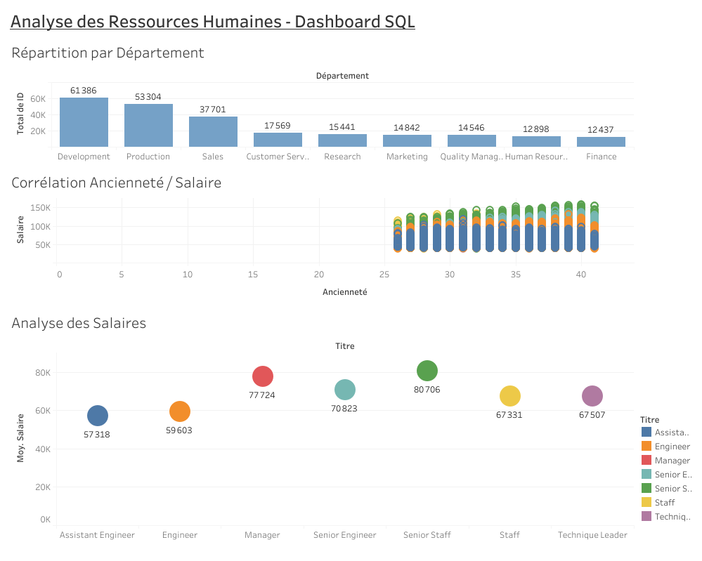

# 📊 HR Analytics — Pipeline dbt sur MySQL

Analyse RH orientée business (turnover, masse salariale, équité salariale) construite sur la base de données publique `employees` (~300 000 lignes), avec un pipeline de transformation **dbt** en couches staging → marts et des tests de qualité automatisés.

## 🎯 Contexte & objectif métier

Un service RH veut piloter ses effectifs et sa politique salariale à partir de données fiables : quel département coûte le plus cher ? Combien de temps faut-il pour atteindre un poste senior ? Les écarts de salaire au sein d'un même département sont-ils justifiés ? Ce projet répond à ces questions via un pipeline reproductible, testé, plutôt que des requêtes ponctuelles.

## 🏗️ Architecture

```
MySQL (base "employees", ~300k lignes)
        │
        ▼
  dbt staging (vues nettoyées : dates sécurisées, renommage)
        │
        ▼
  dbt marts (tables métier : KPIs, classements, benchmarks)
        │
        ▼
  Tableau Public (dashboard interactif)
```

## 🛠️ Stack technique

| Composant | Choix |
|---|---|
| Base de données | MySQL 8.0 (dataset public [`employees`](https://github.com/datacharmer/test_db)) |
| Transformation | dbt-core 1.7 + dbt-mysql |
| Tests de qualité | dbt tests génériques (`unique`, `not_null`) + test custom métier |
| Visualisation | Tableau Public |
| Environnement | Python 3.12 (venv dédié) |

## 📁 Structure du repository

```
├── models/
│   ├── staging/        → nettoyage léger, 1 modèle = 1 table source
│   └── marts/          → logique métier (KPIs, classements, benchmarks)
├── tests/               → tests de qualité custom
├── legacy/scripts/      → version 1 du projet (SQL brut), conservée pour l'historique
├── outputs/             → captures d'écran des résultats
└── dbt_project.yml
```

## 📈 Résultats clés

- **KPIs par département** : effectif, salaire moyen, masse salariale totale (`mart_dept_kpis`)
- **Temps moyen de promotion** vers un poste senior (`mart_promotion_time`)
- **Top 10 des talents fidèles** : ancienneté > 15 ans et salaire > 80k€ (`mart_loyal_talents`)
- **Classement des 3 meilleurs salaires par département** (`mart_salary_ranking`)
- **Écarts salariaux individuels vs moyenne du département**, pour repérer les anomalies (`mart_salary_benchmark`)
- **Historique des augmentations** sur un échantillon de 100 employés (`mart_salary_evolution`)



## ✅ Qualité & fiabilité

Chaque exécution du pipeline est validée par des tests automatisés :
- Intégrité référentielle (`unique`, `not_null` sur les clés)
- Test métier custom : aucun salaire négatif ou nul ne doit exister dans la table pivot

```bash
dbt test
```

## ⚡ Performance

La table pivot `mart_current_employee_stats` (240k+ lignes) est indexée sur `last_name` automatiquement via un post-hook dbt à chaque build, plutôt qu'une étape manuelle séparée.

## 🚀 Installation & reproduction

```bash
python -m venv venv
venv\Scripts\activate          # Windows
pip install dbt-core dbt-mysql

# Configurer ~/.dbt/profiles.yml avec vos identifiants MySQL (voir dbt_project.yml pour le nom du profil)

dbt run
dbt test
dbt docs generate
```

## 🕰️ Évolution du projet

La version initiale (4 scripts SQL exécutés manuellement) est conservée dans `legacy/scripts/` à titre d'historique. Elle a été entièrement remplacée par un pipeline dbt testé et modulaire, illustrant une montée en compétence sur les pratiques d'ingénierie analytique.

## 👤 Auteur

**Alexis Claudeon** — Data Analyst | Analytics Engineer Junior

- 🐙 [GitHub](https://github.com/Alexis45140)
- 💼 [LinkedIn](https://www.linkedin.com/in/alexis-claudeon)